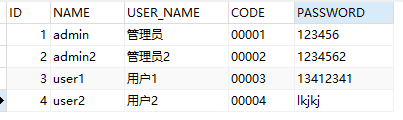
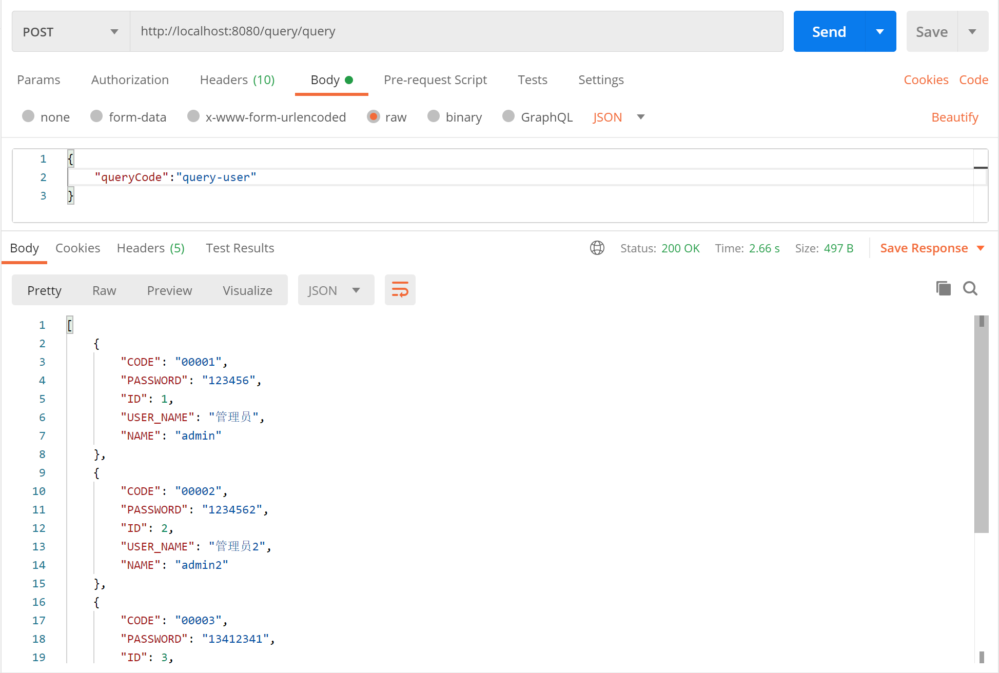
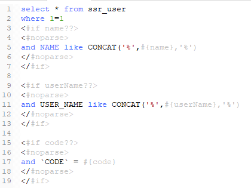

# sql-starts-rapid

#### 一 介绍
##### 1.1 简称：ssr（可以期待下个项目->[ur](https://gitee.com/natsuki_kining/ultra-rare )）

##### 1.2 使用场景：
* 报表查询
* 不需要编写java代码便可构建一个SQL查询
* 经常需要修改SQL语句的查询

##### 1.3 优点：

* 可以在运行时修改sql，而不用重启项目。
* 可以快速的新增一个查询功能，而不用写任何代码。
* 不用再每个查询都新建一个controller

#### 2 各版本主功能说明
* 第1.0版：
    * 通过freemarker实现动态sql。
    * Java拦截器，用于处理查询前后的数据。
    * 脚本拦截器，可调用JavaScript，Python，Groovy等脚本语言处理数据。
    * 缓存，sql查询效率，提供sql优化建议等工具。
    * 多code查询，用于处理内部有多查询的情况。
    * 多数据源，可以设置动态多数据源。
* 第2.0版：
    * sql查询计划解析，分析sql查询计划，记录慢sql，提出修改建议。

#### 3 使用说明

##### 3.1 新增表 SSR_DYNAMIC_SQL
    脚本在file文件夹里

##### 3.2 引入依赖
根据需求引入相应的依赖包
默认实现了mybatis跟hibernate，如果项目是使用其他的orm框架的，可以引入ssr-core

    <dependency>
         <groupId>com.natsuki_kining.ssr</groupId>
         <artifactId>ssr-core</artifactId>
         <version>1.0.0</version>
    </dependency>
然后实现QueryORM接口，如果是使用mybatis的可以直接引入

    <dependency>
         <groupId>com.natsuki_kining.ssr</groupId>
         <artifactId>ssr-mybatis</artifactId>
         <version>1.0.0</version>
    </dependency>
    
如果是使用hibernate的则引入

        <dependency>
             <groupId>com.natsuki_kining.ssr</groupId>
             <artifactId>ssr-hibernate</artifactId>
             <version>1.0.0</version>
        </dependency>

##### 3.3 添加包扫描路径
    com.natsuki_kining
    
##### 3.4 在controller里注入Query并调用里面的方法
```java
@RestController
@RequestMapping("query")
public class QueryController {

    @Autowired
    private Query query;
    
    @PostMapping("page")
    public Object page(@RequestBody QueryParams queryParams) {
        return this.query.queryResult(queryParams);
    }

}
```

##### 3.5 Query接口方法说明
```
```

##### 3.6 QueryParams 参数说明
```
    queryCode:查询code。必须。表ssr_dynamic_sql的query_code字段
    params：传递给sql的查询参数。key->property,value->queryValue
```

##### 3.7 示例


#目录

# 一 介绍

## 功能介绍
## 使用场景

# 二 使用说明

## 2.1 快速入门
### 2.1.1 简单sql查询
* ssr_user中的数据 


* 在ssr_dynamic_sql 表中新增数据：
```sql
INSERT INTO `ssr_dynamic_sql` (`ID`, `QUERY_CODE`, `SQL_TEMPLATE`) VALUES ('1', 'query-user', 'select * from ssr_user');
``` 


* postman请求 


### 2.1.2 带查询条件查询
* 使用freemarker为sql添加查询条件
```sql
INSERT INTO `ssr_dynamic_sql` (`ID`, `QUERY_CODE`, `SQL_TEMPLATE`) VALUES ('1', 'query-user', 'select * from ssr_user \r\nwhere 1=1\r\n<#noparse>\r\n	<#if name??>\r\n	and NAME like \'%#{name}%\'\r\n	</#if>\r\n	<#if userName??>\r\n	and USER_NAME like \'%#{userName}%\'\r\n	</#if>\r\n	<#if code??>\r\n	and `CODE` = \'#{code}\'\r\n	</#if>\r\n</#noparse>');
```

> 其中`<#if>`为添加判断，`<#noparse>`为freemarker`#{}`转义
* postman请求 

> 输出的查询sql语句为 select * from ssr_user  where 1=1 and NAME like CONCAT('%',?,'%')


> 输出的查询sql语句为 select * from ssr_user  where 1=1 and NAME like CONCAT('%',?,'%') and USER_NAME like CONCAT('%',?,'%')

## 2.2 进阶

### 类型转换

### 分页

### 排序

### 2.2.1 拦截器使用
#### 2.2.2 正则匹配
#### 2.2.3 使用场景
#### 2.2.4 自定义拦截器

### 数据处理脚本
#### JavaScript
#### Python
#### Groovy
#### 自定义脚本

### 多数据源
#### 多数据源配置
#### 多数据源使用

### sql生成
#### 根据表名生成
#### 根据实体名生成
#### 多数据源sql生成

### 缓存
#### 内置缓存
#### MapCache
#### 自定义缓存

### orm框架
#### myBatis
#### hibernate
#### 自定义orm框架

### 自定义SSRDynamicSQL表名

### bean说明文档
#### QueryParams

### [使用示例](https://gitee.com/natsuki_kining/ultra-rare)