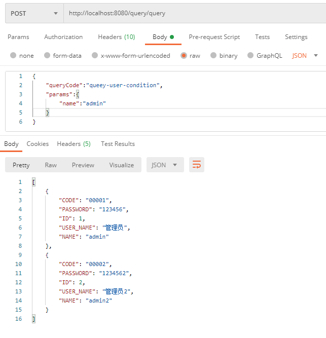

# sql-starts-rapid

-----
#目录

----
# 一 介绍
## 1.1 简称：ssr（可以期待下个项目->[ur](https://gitee.com/natsuki_kining/ultra-rare )）

## 1.2 主要功能
* 可根据传入的参数动态生成查询sql
* 自带拦截器可修改传入的参数跟带入固定的查询条件（例如登录用户的id）
* 内部集成三种脚本语言可以预处理查询结果
* 集成hibernate跟mybatis两种orm查询框架
* 实现多数据源动态配置

## 1.3 使用场景 
* 报表查询
* 不需要编写java代码便可构建一个SQL查询
* 经常需要修改SQL语句的查询
* 可以在运行时修改sql，而不用重启项目。
* 可以快速的新增一个查询功能，而不用写任何代码。
* 不用再每个查询都暴露一个api方法

## 1.4 各版本主功能说明
* 第1.0版：
    * 通过freemarker实现动态sql。
    * Java拦截器，用于处理查询前后的数据。
    * 脚本拦截器，可调用JavaScript，Python，Groovy等脚本语言处理数据。
    * 缓存，sql查询效率，提供sql优化建议等工具。
    * 多code查询，用于处理内部有多查询的情况。
    * 多数据源，可以设置动态多数据源。
* 第2.0版：
    * sql查询计划解析，分析sql查询计划，记录慢sql，提出修改建议。

# 二 使用说明

## 2.1 快速体验（运行的是test-ssr-mybatis项目）

* ssr_user中的数据     


### 2.1.1 简单sql查询

* 在ssr_dynamic_sql 表中新增数据：
```sql
INSERT INTO `ssr_dynamic_sql` (`ID`, `QUERY_CODE`, `SQL_TEMPLATE`) VALUES ('1', 'query-user', 'select * from ssr_user');
``` 

* postman请求   


### 2.1.2 带查询条件查询
* 使用freemarker为sql添加查询条件
```sql
INSERT INTO `ssr_dynamic_sql` (`ID`, `QUERY_CODE`, `SQL_TEMPLATE`) VALUES ('1', 'query-user', 'select * from ssr_user \r\nwhere 1=1\r\n<#if name??><#noparse>\r\nand NAME like CONCAT(\'%\',#{name},\'%\')\r\n</#noparse></#if>\r\n<#if userName??><#noparse>\r\nand USER_NAME like CONCAT(\'%\',#{userName},\'%\')\r\n</#noparse></#if>\r\n<#if code??><#noparse>\r\nand `CODE` = #{code}\r\n</#noparse></#if>');
```

> 其中`<#if>`为添加判断，`<#noparse>`为freemarker`#{}`转义
* postman请求      

> 输出的查询sql语句为 select * from ssr_user  where 1=1 and NAME like CONCAT('%',?,'%')
* postman请求      

> 输出的查询sql语句为 select * from ssr_user  where 1=1 and NAME like CONCAT('%',?,'%') and USER_NAME like CONCAT('%',?,'%')

### 2.1.3 返回封装的类型
* 在query接口里传入需要转换的类型
```java
    @PostMapping("queryUser")
    public Object queryUser(@RequestBody QueryParams queryParams) throws ClassNotFoundException {
        Class<?> aClass = Class.forName("com.natsuki_kining.ssr.test.entity.SSRUser");
        List<?> result = this.query.queryList(queryParams, aClass);
        return result;
    }
```
* postman请求  


## 2.2 快速入门

### 2.2.1 新增表 SSR_DYNAMIC_SQL
    脚本在file文件夹里，根据使用的数据库选择对应的脚本

### 2.2.2 引入依赖
根据需求引入相应的依赖包
默认实现了mybatis跟hibernate，如果项目是使用其他的orm框架的，可以引入ssr-core

    <dependency>
         <groupId>com.natsuki_kining.ssr</groupId>
         <artifactId>ssr-core</artifactId>
         <version>1.0.0</version>
    </dependency>
然后实现QueryORM接口，如果是使用mybatis的可以直接引入

    <dependency>
         <groupId>com.natsuki_kining.ssr</groupId>
         <artifactId>ssr-mybatis</artifactId>
         <version>1.0.0</version>
    </dependency>
    
如果是使用hibernate的则引入

        <dependency>
             <groupId>com.natsuki_kining.ssr</groupId>
             <artifactId>ssr-hibernate</artifactId>
             <version>1.0.0</version>
        </dependency>

### 2.2.3 添加包扫描路径
    com.natsuki_kining
    
### 2.2.4 在controller里注入Query并调用里面的方法
```java
@RestController
@RequestMapping("query")
public class QueryController {

    @Autowired
    private Query query;
    
    @PostMapping("page")
    public Object page(@RequestBody QueryParams queryParams) {
        return this.query.query(queryParams);
    }

}
```
## 2.3 进阶

### 2.3.1 Query接口介绍

### 2.3.1 返回指定的类型
Query接口里的每个方法都有个重载方法，可传输指定的类型，直接调用为Map类型。


### 2.4.1 分页跟排序
* 分页
设置pageNo跟pageSize两个参数即可。    
  
输出的sql语句：
> select * from ssr_user LIMIT 0,2

* 排序
设置sort参数即可    

输出的sql语句：
> select * from ssr_user ORDER BY NAME DESC

### 2.3.1 拦截器使用
#### 2.3.1.1 Java拦截器
* 直接继承AbstractQueryJavaIntercept类，然后重写里面方法，交给spring管理。如果没有`@QueryCode`加入这个注解，则默认拦截所有的查询。`@QueryCode`注解支持正则表达式，只拦截匹配的queryCode
例： 
```java
@Component
public class SSRQueryIntercept extends AbstractQueryJavaIntercept {

    @Override
    public boolean preHandle(QueryParams queryParams) {
        return true;
    }
    @Override
    public void queryBefore(QueryParams queryParams, QueryInfo queryInfo, SSRDynamicSQL ssrDynamicSQL, Map<String, Object> map) {
        System.out.println("master intercept:"+queryParams.getQueryCode());
    }
    @Override
    public Object queryAfter(QueryParams queryParams, QueryInfo queryInfo, SSRDynamicSQL ssrDynamicSQL, Map<String, Object> map, Object data) {
        return data;
    }
}
```
* 拦截方法介绍
    * preHandle 返回true则继续执行，返回false则不执行该查询。
    * queryBefore 查询前参数处理。可以添加新的查询参数或者修改前端传来的参数。例如添加当前登录用户的id
    * queryAfter 查询结果处理，例如屏蔽敏感信息。

#### 2.3.1.1 脚本拦截器
* 可以将数据处理写到数据库里，不需要编写java代码，可动态修改。默认实现了三种脚本处理。

#### 2.3.2 自定义脚本拦截器
* 继承AbstractQueryScriptIntercept
* 重写executeScript
* 加上`@Component`注解交给spring管理
* 加上`@ConditionalOnProperty`注解，按配置条件注入
* 在配置文件上加上注解里的条件

#### 2.3.2 正则匹配
#### 2.3.3 使用场景


### 数据处理脚本
#### JavaScript
#### Python
#### Groovy
#### 自定义脚本

### 多数据源
#### 多数据源配置
#### 多数据源使用

### sql生成
#### 根据表名生成
#### 根据实体名生成
#### 多数据源sql生成

### 缓存
#### 内置缓存
#### MapCache
#### 自定义缓存

### orm框架
#### myBatis
#### hibernate
#### 自定义orm框架

### 自定义SSRDynamicSQL表名

### bean说明文档
#### QueryParams

### [使用示例](https://gitee.com/natsuki_kining/ultra-rare)